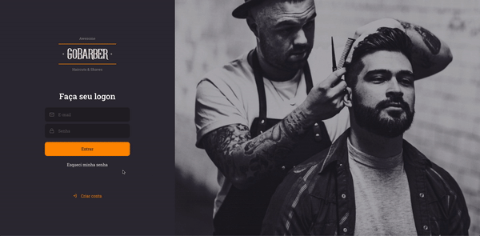

<p align="center">
    
</p>

<h1 align="center">
   💈 GoBarber 💈 
</h1>

<p align="center">


</p> 

<p align="center">
  <a href="#computer-about-the-project">About the Project</a>&nbsp;&nbsp;&nbsp;|&nbsp;&nbsp;&nbsp;
  <a href="#hammer-technologies">Technologies</a>&nbsp;&nbsp;&nbsp;|&nbsp;&nbsp;&nbsp;
  <a href="#rocket-getting-started">Getting Started</a>&nbsp;&nbsp;&nbsp;|&nbsp;&nbsp;&nbsp;
  <a href="#mailbox-contacts">Contacts</a>&nbsp;&nbsp;&nbsp;|&nbsp;&nbsp;&nbsp;  
  <a href="#memo-license">License</a>&nbsp;&nbsp;&nbsp;
</p>

<br>

<p align="center">
  
</p>

<br>

<p align="center">
  
</p>

<br>

## :computer: About the Project 

GoBarber is a tutorial project made on Rocketseat's GoStack Bootcamp, a complete application with Backend using Node.js, Frontend with ReactJS and Mobile with React Native.

## :hammer: Technologies

This project was built with:

-  [Typescript](https://www.typescriptlang.org/)
-  [Node.js](https://nodejs.org/)
-  [ReactJS](https://reactjs.org/)
-  [React Native](https://facebook.github.io/react-native/)
-  [@rocketseat/unform](https://github.com/Rocketseat/unform)
-  [Styled-components](https://www.styled-components.com/)
-  [React-toastify](https://github.com/fkhadra/react-toastify)
-  [React Navigation](https://reactnavigation.org/)
-  [React-icons](https://react-icons.netlify.com/)
-  [Express](https://expressjs.com/pt-br/)
-  [Docker](https://www.docker.com/docker-community)
-  [Axios](https://github.com/axios/axios)
-  [Polished](https://polished.js.org/)
-  [Yup](https://www.npmjs.com/package/yup)
-  [Date-fns](https://date-fns.org/)
-  [react-day-picker](https://react-day-picker.js.org/)
-  [ESLint](https://eslint.org/)
-  [Prettier](https://prettier.io/)
-  [EditorConfig](https://editorconfig.org/)
-  [VS Code](https://code.visualstudio.com/)


## :rocket: Getting Started

**Clone or Download the Repository**

```bash
$ git clone https://github.com/Johnny-Saraiva/go-barber.git

# Back-end server 
$ cd go-barber/backend

# Front-end web 
$ cd go-barber/frontend

# Mobile
$ cd go-barber/mobile
```

**Installing Dependencies**

```bash
# if you use yarn, run this:

$ yarn
```
or
```bash
# if you use npm, run this:

$ npm install
```

**Installing Docker Image**

```bash

# Install the Postgres image on the docker:

$ docker run --name gostack-postgres -e POSTGRES_USER=docker -e POSTGRES_DB=gobarber -e POSTGRES_PASSWORD=docker -p 5432:5432 -d postgres

# start Postgres
$ docker start gostack-postgres

```

**Back-end**

```bash

# run migrations
$ yarn typeorm migration:run

# start server
$ yarn dev:server

```

### Frontend

```bash

$ cd frontend

$ yarn

$ yarn start

```

### Mobile

```bash

$ cd mobile

$ yarn

# If you want to run with an iPhone simulator, but need to have a mac and Xcode configured.
$ yarn ios

# If you want to run with an Android
$ yarn android

```

## :mailbox: Contacts

Connect with me on [LinkedIn](https://www.linkedin.com/in/johnny-saraiva-701641164/).

## :memo: License

This project is under the MIT license. See the [LICENSE](LICENSE.md) for more information..

---

Made with ❤️ by Johnny Saraiva 👋 [Get in touch!](https://www.linkedin.com/in/johnny-saraiva-701641164/)
